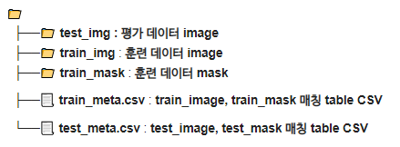
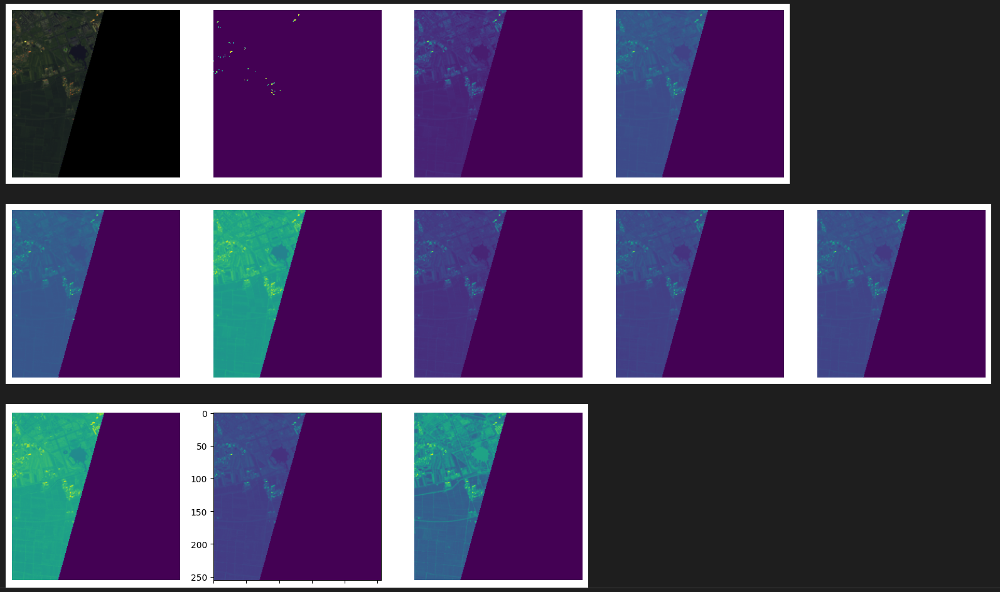

# AI-Spark 
제6회 2024 연구개발특구 AI SPARK 챌린지
## 주제
> AI를 활용한 향상된 위성 이미지 분석

## 팀원
| 이름     | GitHub URL                  |
|---------|-------------------------|
| 고건영   | [goodyoung](https://github.com/goodyoung) |
| 오승범   | [Sbeom12](https://github.com/Sbeom12) |

## 결과

* 최종적으로 97등 mIou 0.7939575 달성.
* 저희 팀은 아쉽게도 높은 등수는 기록하지 못했습니다.

## 대회 설명
* 공개된 활성산불 이미지를 활용하여 인공지능 기반의 산불 재난을 감지하는 것이 목적.
* 산불 감지를 위한 **Semantic Segmentation**
* mIou의 평가 방식을 이용한 점수 채점.
* Pretrained된 가중치는 사용가능 여부를 확인해야함.
    * 산불 판단용으로 학습된 가중치 사용 불가.

## Data

## Core Strategy
* Unet
* Focalloss
* Diceloss
* pretrained imagenet
* one-channel input

## EDA

  

자세히 보기

* 위성 이미지
    * 위성 이미지 데이터 셋이라서 그런지 10개의 채널로 구성되어 있었음.
    * 이미지 크기 : (256, 256, 10)
    * 파일 형식 : .tif
    * R,G,B를 7,6,2 채널로 확인해서 보면 산불에 대한 지역이 구분이 잘되었음
* 특이점.
    * 학습 시 7,6,2의 3개 채널을 input으로 넣었을 때 결과가 좋지 않아서 이를 7번 1개의 채널만 투입했을 때의 결과가 좋아 1개의 채널에 대해서만 진행.
* 산불 입력 이미지에 대한 다양한 처리
  
    * 첫번째 줄 가장 왼쪽이 7,6,2 channel로 확인한 결과, 그 오른쪽이 mask를 시각화한 결과.
    * 나머지는 하나의 채널을 생성하기 위해서 다양한 처리를 진행. 
    * 최종적으로 아래 수식으로 image를 전처리 해줬다.
     $$\frac{7_{channel}}{(7_{channel}+6_{channel}+2_{channel})}$$   
     

## Model
* Unet을 기본으로 Encoder는 Efficientnet-b5를 사용.
* 다른 Unet++, Deeplabv3, Deeplabv3+도 사용해서 학습을 진행했으나 실제로 학습 시간만 더 오래 걸리고 결과는 더 안좋았기 때문에 사용하지 않다.

## KPT 회고
- KEEP
    > 잘 해와서 유지하고 싶은 것
    - ggy
        - 처음 0.005점에서 헤매고 있을때부터 0.79까지 올린 것을 생각하면 차근차근 많이 올렸다고 생각한다. 이런 포기하지 않고 점수를 높이기 위한 방안을 끝까지 찾아보는 마음 자세를 유지해야할 것 같다.
    - osb
        - 중간중간에 점수가 정체되는 구간이 있었으나, 계속 새로운 돌파구를 생각해서 점수를 갱신한 것이 좋았다. `중요한 건 역시 꺽이지 않는 마음 같다.`
- PROBLEM
    > 어려움을 느껴서 개선하고 싶은 것
    - ggy
        - loss에 대한 지식, 모델 지식, 이미지 전처리 등이 부족하여 전반적으로 가정에 대한 근거를 가지고 실험을 해본적이 별로 없었던 것 같다. 어느 한 분야, 지식이라도 근거를 가질 수 있는 능력을 개선하고 싶다.
    - osb
        - image segmentation이 무엇인지만 알고 단순히 대회를 진행했었기 때문에 실제 구현 단계에서 어려움을 느꼈고 다양한 sota 모델들을 사용하기 위해 시도했으나, 구현하지 못해서 해당 git에서 배포된 것을 사용할 수 있는 능력을 개선하고 싶다.
- TRY
    > 어떻게 개선할 것인지에 대한 부분
    - ggy
        - 이번에 내가 많이 부족한 분야를 알게 되었으니 부족한 부분을 공부를 통해 채워나가면 될 것 같다. 그래서 승범씨와 다시 기초를 다지기로 했다. 
    * osb
        * 해당 분야에 대한 지식을 얻기 위해서는 위에서부터 아래로 내려가는 것이 가장 좋다고 하지만, 현재 상태는 사상누각이라 할 수 있을정도로 기반이 탄탄하지 않기 때문에 이번에 아래에서 위로 올라가는 방식으로 스터디를 진행하고자 한다.

## 관련 스터디 진행.
* [스터디 링크](https://github.com/Sbeom12/basic-for-Segmentation)
